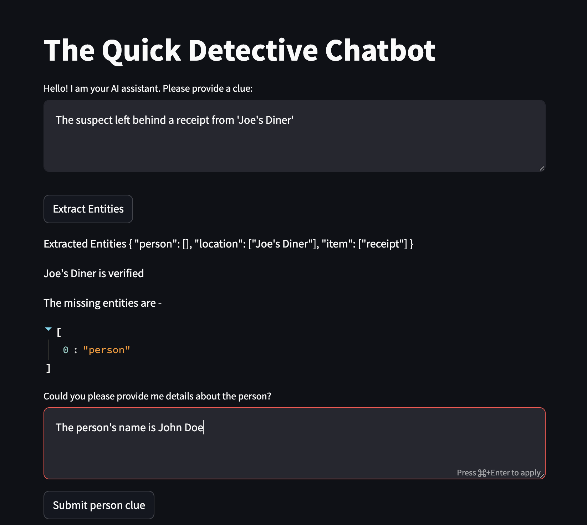
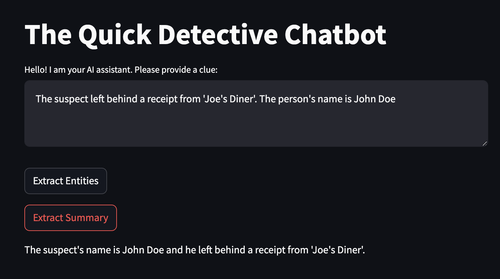
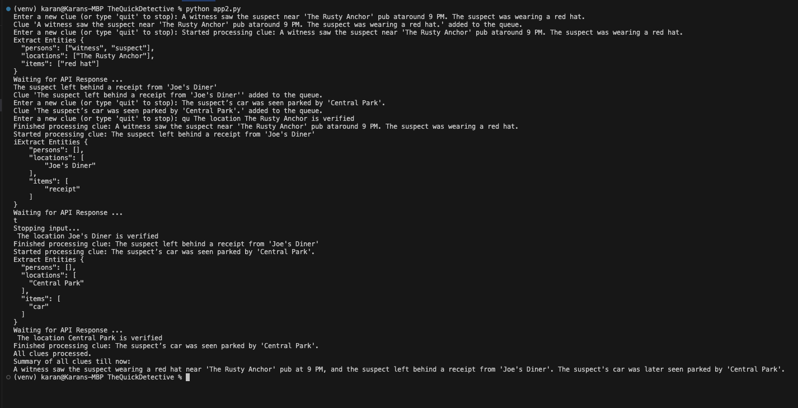

# The Quick Detective Chatbot

## Problem Statement - 

You are developing an AI assistant for a detective agency. This AI, "The Quick Detective", needs to help solve a simple case using minimal, yet effective, LLM features.

### Tasks:
#### 1. Analysis:
   Implement a simple function where "The Quick Detective" can analyze text clues. 
   Use an LLM to:
     Summarize clues.
     Identify key entities (persons, locations, items) from the text.
#### 2. Function Calling:
   Integrate a function call to an external service (e.g.,a simple mock API you create for this purpose) to verify or gather additional information about a location mentioned in the clues.
#### 3. Simple Agentic Behavior:
   Design a basic decision making logic where the AI decides whether to:
     Ask for more clues from the user
     Use the API for location verification.
     Provide a summary or hypothesis based on the information gathered so far.
#### 4. Basic Asynchronous Handling:
   Implement a queue system where if multiple clues are submitted, they're processed in order but not sequentially (e.g., while waiting for an API response, another clue can start being analyzed).   

## My approach - 

For task 1, we can use the OpenAI gpt-3.5-turbo LLM using Langchain framework to obtain summary of the texts and identify key entities (persons, locations, items). Since we are using langchain we can use PromptTemplate and RunnableSequence. 

For task 2, we can create a function that uses a mock url to simulate an API-based location verification process. 

For task 3, I had TWO contrasting understanding of this agentic behavior.

  - We need to solve the mystery using the clues. For example, when we extract the first clue, there could be an item or person missing from this clue. So we ask the user to provide more clues about the missing entity so that we have enough information to solve the mystery. 

   

   Here the user types the clue and clicks Extract Entites button. On click the entities {person, location, item} are extracted. Then since location is present we can verify the location. Since in this example persons entity is missing, the user is prompted to provide more details about the person. 

   

   Here the Summary of all the clues are extracted. 

  Another solution is that we do not bother about the missing entities and do not prompt the user to give more relevant clues based on the first clue. We treat all clues as standalone and use LLM to extract entities. We use the API for location verification and a summary of all the clues obtained at the end. This solution is designed to function on CLI itself. 

For task 4, we can use asyncio package in python to handle asynchronous tasks. we use asyncio.Queue to manage clues. One important thing to note is that the generic input() should be replaced with aioconsole.ainput() to handle asynchronous handling and await can you be used to allow tasks to run while waiting for queue operation to complete. 

Output Screenshot - 

Process flow - 

1. The user enters the first clue
2. The first clue starts processing immediately and the entities are extracted using API call made to the LLM model. 
3. Since the location entity is extracted, we can perform a quick API call to extract more information about the location like nearby landmarks, exact coordinates etc. 
4. We do not need to wait for the location verification (this typically takes 10 seconds), we can keep getting new clues from the user. 
5. All the clues are stored in a queue and once the clue is processed, it is poped from the queue. 

## How to run - 

1. Clone this repository :[git clone (https://github.com/karans98/TheQuickDetective.git)]
2. Once cloning is complete, navigate to the cloned repository :[cd TheQuickDetective]
3. Install the Python libraries mentioned in the requirements.txt file :[pip install -r requirements.txt]
4. Run the Python file :[python app2.py]

  
